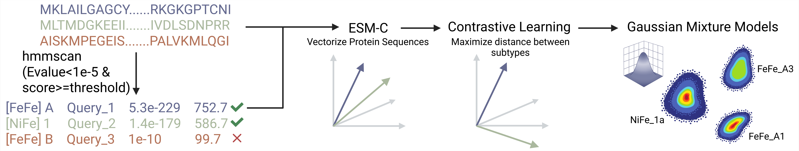

#  HySort: Hydrogenase subtype classifier

HySort is a computational tool for identifying potential hydrogenases in genomic data and classifying their subtypes. It combines: Hidden Markov Model (HMM) search for hydrogenase candidates and Gaussian Mixture Models (GMMs) with updated protein embeddings from contrastive learning of embeddings from the protein language model ESM-C for subtype classification. 



# Installation
## Prerequisites
1. Python 3.8+
2. System-wide accessible dependencies:

	`hmmscan`
	
	`seqkit`
> You can install both tools using `conda`:
```
conda install bioconda::seqkit
conda install bioconda::hmmer
```
> Alternatively, you may install them from source. If you do, make sure to add their installation directories to your system PATH (replace /path/to/software with the actual path):
```
export PATH="$PATH:/path/to/software"
```

## Step-by-Step Installation
1. Clone the repository:
```
git clone https://github.com/Microme-pz/HySort.git
cd HySort
git lfs pull # pull gmms manually 
```
2. Create and activate a Python environment (recommended):
```
python -m venv hysort_env
source hysort_env/bin/activate
```
3. Install dependencies:
```
pip install -r requirements.txt
```

# Usage
When you first run the software, it will download the ESM-C 300M model from Hugging Face. This download occurs only once—future runs will use the locally cached model and will not require re-downloading.

## Basic Commands
```
# Show help menu
./hysort -h

# Analyze a single protein file
./hysort --input_file tests/test.fa

# Process multiple files in a directory
./hysort --protein_dir tests --file_extension .fa
```

## GPU Acceleration
```
./hysort --input_file tests/test.fa --device cuda      # Default GPU
./hysort --input_file tests/test.fa --device cuda:0    # Specific GPU
```
